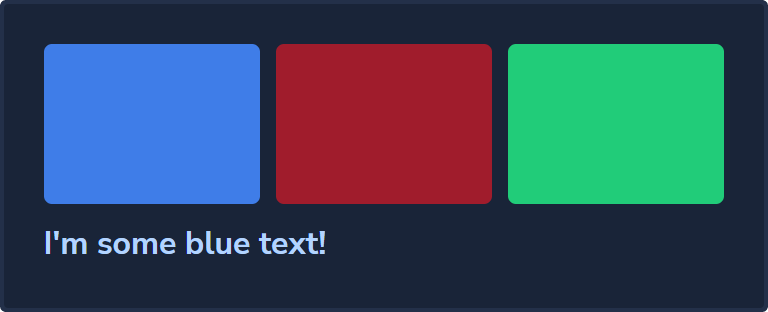

# Blip Design System Plugin for Tailwind CSS

## Installation

Install the plugin from npm:

```bash
npm install -D tailwind-blip-ds
```

Then add the plugin to your `tailwind.config.js` file:

```js
// tailwind.config.js

module.exports = {
  theme: {
    // ...
  },
  plugins: [
    require('tailwind-blip-ds'),
    // ...
  ],
}
```

## Usage

### Colors

Use the colors with tailwind classes like `bg-*`, `text-*`, `border-*`, etc...

See the full list of colors [here](https://takenet.github.io/blip-ds/?path=/story/colors--all-colors).

Code:

```html
<div className="bg-neutral-dark-ico border-neutral-dark-skate border-2 rounded p-5 grid grid-cols-3 gap-2">
  <div className="bg-primary-main rounded h-20" />
  <div className="bg-extend-reds-lipstick rounded h-20" />
  <div className="bg-primary-greens-true rounded h-20" />
  <div className="text-primary-light col-span-full font-bold">
    I'm some blue text!
  </div>
</div>
```

Result:



### Typography

TODO

### Shadows

TODO